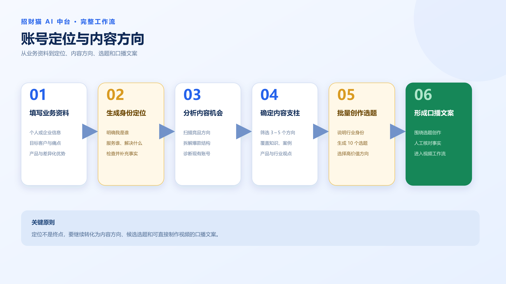
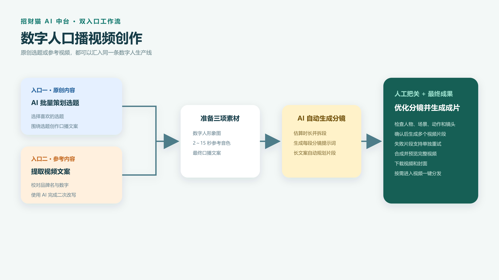
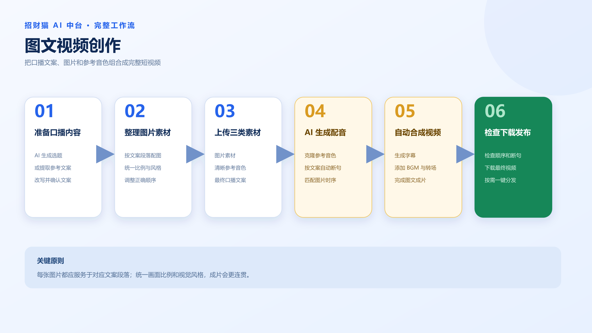
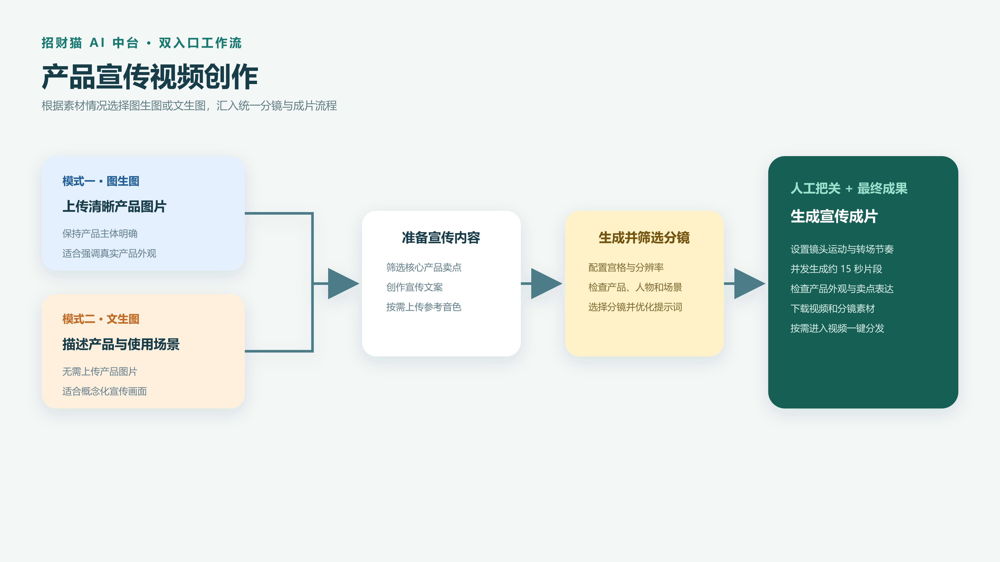
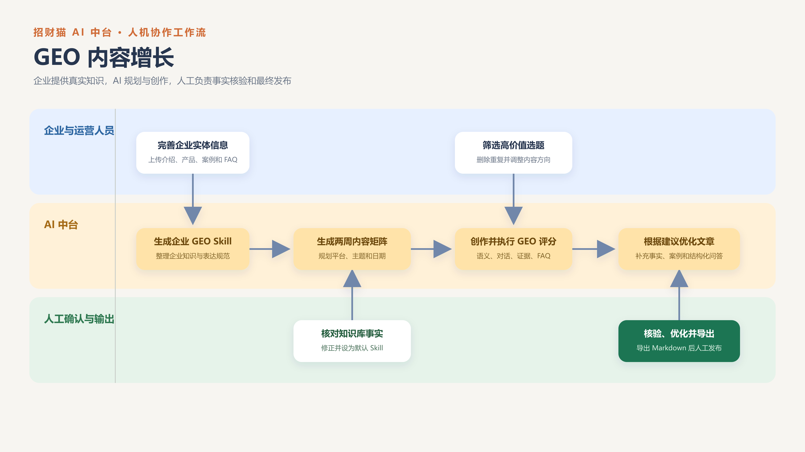

# 招财猫 AI 中台使用教程

本教程不按菜单逐项介绍，而是围绕实际业务成果，讲清楚如何从一个想法开始，经过内容创作、素材准备和 AI 生成，最终得到可以使用和发布的内容。

建议第一次使用时先阅读“开始前准备”，随后直接选择自己要完成的工作流。

---

## 一、开始前准备

正式创作前，建议先完成以下准备：

1. 登录 AI 中台，确认账户积分充足。
2. 准备个人、企业、产品或服务的基础资料。
3. 明确本次内容面向谁、解决什么问题、希望用户采取什么行动。
4. 如需一键分发，提前在账号绑定中完成目标平台授权。

AI 生成效率很高，但业务事实、品牌名称、产品信息和最终发布内容仍需人工确认。

---

## 二、账号定位与内容方向工作流

### 适用场景

适合刚开始做个人 IP、企业账号定位不清晰，或不知道应该长期发布什么内容的用户。

> 图 1：从业务资料、身份定位到选题和口播文案的完整流程。

### 工作流程

第一步，进入“身份定位”，填写个人或企业的基本资料，包括所在行业、主要业务、目标客户、客户痛点、核心产品和差异化优势。已有公司介绍、产品手册或历史内容时，可以作为补充资料提交。

第二步，让 AI 生成定位结果。重点检查“我是谁、服务谁、解决什么问题、为什么选择我”是否准确。如果结果过于宽泛，应补充更具体的客户类型、业务场景和实际案例后重新生成。

第三步，使用竞品扫描了解同行的定位与内容方向；使用爆款分析拆解高传播内容的标题、开头、结构和转化方式；使用账号诊断检查自己的定位、内容一致性和转化路径。

第四步，根据分析结果确定 3～5 个长期内容方向。例如：行业知识、客户避坑、产品使用、真实案例、经营观点。

第五步，进入“文案创作”，告诉 AI 你的行业身份，并让 AI 围绕内容方向批量生成选题。例如：

> 我是一名做烟酒生意的老板，目标客户是有商务宴请和送礼需求的人。请围绕选购避坑、真假辨别、商务送礼和行业知识，创作 10 个容易引发关注的短视频选题。

第六步，从候选选题中选择符合客户需求、同时能够体现业务优势的选题，再让 AI 创作口播文案。确认文案中的事实、案例和表达方式后，即可进入视频创作工作流。

### 最终成果

- 一份清晰的个人或企业定位
- 3～5 个长期内容方向
- 一批可持续创作的选题
- 可直接进入视频制作的口播文案

---

## 三、数字人口播视频创作工作流

### 适用场景

适合知识分享、老板 IP、企业介绍、产品讲解、行业观点和短视频口播内容。

> 图 2：原创选题或文案提取进入数字人口播视频生产线的完整流程。

### 第一步：准备口播内容

口播内容有两种准备方式。

方式一是原创选题。进入“文案创作”，告诉 AI 你的行业身份和目标客户，让 AI 批量生成 10 个选题；选择喜欢的选题后，再让 AI 围绕该选题创作口播文案。

方式二是参考已有视频。进入“文案提取”，粘贴视频链接或分享口令，提取原视频文案；校对品牌名、数字和专业术语后，使用“AI 改写”调整观点、结构和表达，避免直接照搬原内容。

无论使用哪种方式，都应检查文案是否具备清晰开头、核心观点、具体内容和结尾引导。文案越口语化，数字人口播效果越自然。

### 第二步：准备数字人素材

准备一张清晰的数字人形象图。人物主体应完整、面部清楚、无遮挡，画面风格应符合账号定位。

如需克隆音色，准备一段 2～15 秒的清晰参考音频。音频中尽量只有一个人说话，不要包含背景音乐、明显杂音或多人对话。

### 第三步：生成分镜脚本

进入“数字人口播视频（新）”，上传数字人形象图和参考音频，将最终口播文案粘贴到文案区域。

提交后，系统会根据文案长度自动估算时长、拆分内容并生成分镜脚本。长文案会被拆成多个视频片段，每段按约 15 秒规划。

### 第四步：优化分镜提示词

生成分镜后，不要立即提交成片。逐段检查人物、场景、动作、镜头和文案是否一致。

如果人物外观、背景环境或动作描述不符合预期，应直接修改对应分镜提示词。提示词应具体描述“谁、在哪里、做什么、镜头如何呈现”，避免只写“高级感”“氛围好”等模糊要求。

### 第五步：生成并检查视频

确认分镜后提交视频生成，等待各片段完成。任务进行期间可以查看每个分镜的状态；如果只有个别片段失败，可单独重试，不必重新生成全部内容。

所有片段完成后，系统会合成完整视频。预览时重点检查人物一致性、口型、画面跳转、字幕和声音是否正常。

### 第六步：下载或发布

确认成片后下载视频和封面。任务也会保留在“历史记录”中，方便后续查看。

如需发布，可进入“视频一键分发”，选择生成的视频，填写标题与描述，选择已绑定平台并启动发布。正式发布前务必再次确认视频、标题、描述和平台账号。

### 最终成果

- 一条完整数字人口播视频
- 一张视频封面
- 可复用的选题、口播文案和分镜提示词

---

## 四、图文视频创作工作流

### 适用场景

适合案例展示、产品介绍、知识清单、门店展示和不需要固定数字人出镜的内容。

> 图 3：从口播内容、图片和参考音色到图文视频成片的完整流程。

### 工作流程

第一步，先通过“文案创作”生成选题和口播文案，或通过“文案提取”获取参考内容并完成二次改写。

第二步，根据文案结构准备图片。每张图片对应一段内容，图片顺序应与口播逻辑一致。建议统一画面比例和视觉风格，避免清晰度差异过大。

第三步，准备清晰参考音色，进入“图文视频”，上传图片、参考音色和口播文案。

第四步，调整图片顺序，确认文案、图片和声音表达一致，然后提交任务。系统会完成音色克隆、配音生成、字幕、背景音乐、转场和视频合成。

第五步，预览成片，检查图片顺序、字幕断句、配音和画面切换。如果任务失败，优先检查素材数量、格式、大小和上传状态。

第六步，下载视频；需要发布时，将成片加入视频分发库，填写发布文案并选择已绑定平台。

### 最终成果

- 一条图文口播视频
- 一套按文案顺序整理的图片素材
- 可直接用于发布的标题和描述

---

## 五、视频混剪创作工作流

### 适用场景

适合已有门店、产品、活动、施工、服务过程或案例视频素材，希望快速重新剪辑成口播短视频的用户。

> 图 4：从已有视频素材和口播文案到混剪成片的完整流程。

### 工作流程

第一步，通过 AI 创作选题和口播文案，或提取参考视频文案后完成二次改写。

第二步，准备多段与文案内容相关的视频素材。素材应尽量覆盖不同场景和景别，并提前删除明显无关、模糊或重复的片段。

第三步，准备参考音色。如需生成视频封面，可另外准备一张封面参考图；不需要封面时可以跳过。

第四步，进入“视频混剪”，上传视频素材、参考音色和口播文案，并根据需要上传封面参考图。

第五步，确认素材完整后提交任务。系统会生成配音，并通过剪辑模板完成视频组合、字幕、背景音乐和转场。

第六步，预览视频，重点检查素材与口播内容是否对应、镜头节奏是否自然、字幕是否准确、背景音乐是否影响人声。

第七步，下载视频和封面，并根据需要进入视频一键分发。

### 最终成果

- 一条重新组合的视频混剪成片
- 可选的视频封面
- 一套可继续复用的原始视频素材库

---

## 六、产品宣传视频创作工作流

### 适用场景

适合新品展示、产品卖点介绍、品牌宣传、电商推广和活动预热。

> 图 5：图生图与文生图两种模式汇入产品宣传视频生产线的完整流程。

### 工作流程

第一步，整理产品名称、目标客户、核心卖点、使用场景、差异化优势和希望用户采取的行动。

第二步，进入“文案创作”，让 AI 先生成多个宣传角度和选题；选择一个方向后，生成完整宣传文案。文案应围绕一个核心卖点展开，不要在一条短视频中堆积过多信息。

第三步，进入“宣传视频”并选择生成模式。图生图模式需要上传清晰产品图片；文生图模式可以直接通过画面描述生成分镜素材。

第四步，填写产品场景描述和宣传文案，根据需要上传产品图片与参考音色，并设置分镜宫格、分辨率和生成参数。

第五步，生成分镜图。逐张检查产品外观、使用场景、人物动作和品牌调性，选择合适分镜；不准确的画面提示词应先修改再生成视频。

第六步，填写或优化视频提示词，明确镜头运动、氛围和转场节奏，然后提交视频生成。系统会并发生成多个约 15 秒的视频片段并合成成片。

第七步，预览并检查产品是否清晰、卖点是否准确、分镜是否连贯。确认后下载视频，并根据需要进入视频一键分发。

### 最终成果

- 一条产品宣传视频
- 一组可复用的产品分镜图
- 一套产品宣传文案和视频提示词

---

## 七、GEO 内容增长工作流

### 适用场景

适合希望持续生产企业专业内容，并提升品牌信息被生成式 AI 准确理解和引用机会的企业用户。

> 图 6：从企业知识库、内容矩阵到 GEO 深度文章导出的完整流程。

### 第一步：建立企业知识库

进入“企业知识库搭建”，填写企业名称、品牌、业务、产品服务、目标用户、优势和其他关键事实。

上传公司介绍、产品手册、案例、服务说明和常见问题等资料，确认文档解析成功后生成 GEO Skill。人工核对其中的业务事实，修正错误或过时信息，并按需要设为默认 Skill。

### 第二步：规划内容矩阵

进入“内容矩阵规划”，新建项目，选择发布平台，填写业务、目标用户、内容目标和规划方向，并引用已经建立的企业知识库。

生成两周内容矩阵后，检查选题是否重复、是否符合目标用户需求、是否能体现企业优势。修改不合适的选题，保留真正值得持续创作的内容方向。

### 第三步：创作深度文章

从内容矩阵选择选题，或手动输入文章主题；选择发布平台和企业知识库后生成文章初稿。

初稿完成后，人工检查标题、业务事实、产品信息、案例和引用，避免 AI 生成不准确内容。

### 第四步：执行 GEO 优化

使用 GEO 评分检查文章的语义清晰度、对话语气、证据密度和结构化 FAQ。

根据评分建议优化正文：补充明确概念、真实数据、业务案例和用户常见问题；调整标题层级，让文章结构更容易被读者和 AI 理解。完成修改后重新评分。

### 第五步：导出内容

确认文章事实、结构和评分达到要求后，导出 Markdown 文档，用于官网、公众号或其他内容渠道。GEO 文章一键分发当前标记为“即将开放”，现阶段应先导出后人工发布。

### 最终成果

- 一套可复用的企业知识库和 GEO Skill
- 一份两周内容矩阵
- 多篇经过 GEO 评分优化的深度文章

---

## 八、成品管理与发布建议

视频生成后，建议先在历史记录中检查并下载原始成片和封面，再进入发布流程。不要只保留平台发布后的压缩版本。

一键分发前应完成目标平台绑定，并确认当前 Chrome 登录状态正常。选择视频后填写标题和描述，再选择平台依次发布。遇到手机验证时，需要在弹出的 Chrome 窗口中人工完成验证和最终确认。

建议为每条内容保留以下资料：原始选题、最终文案、素材文件、分镜提示词、成片、封面和发布文案，方便后续复盘与二次创作。
