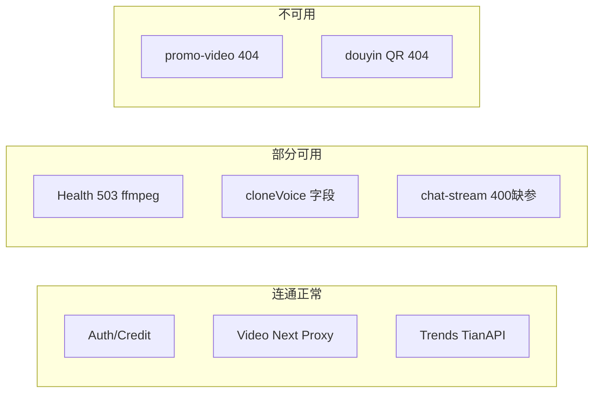

# API 连通性与健壮性排查报告

> **2026-06-29 修复后复测**：25/25 smoke PASS；`/health` 200（`pnpm ffmpeg:ensure` + `dev:api` 自动注入）；promo 路由已注册；credit 充值页改 ledger；Douyin QR UI 已禁用；cloneVoice 走 Next 代理 + `audio_base64`。

**执行时间**：2026-06-29  
**环境**：本地 `pnpm dev:all`（Next.js `http://127.0.0.1:3000` + FastAPI `http://127.0.0.1:8000`）  
**范围**：路由存在性、Next↔FastAPI 代理链、请求字段匹配、服务探活（不含账号/安全审计）  
**原始数据**：[`smoke-results.json`](./smoke-results.json) · 复跑命令：`node scripts/smoke-api-connectivity.mjs`

---

## 1. Executive Summary

| 类别 | 数量 | 说明 |
|------|------|------|
| **连通正常** | 8 模块 | Auth、Credit（余额/兑换）、Video 代理（数字人/图文/混剪 status & submit）、Trends、Next 健康代理链 |
| **部分可用** | 3 模块 | Health（503 degraded）、AI chat-stream（路由通，缺参 400）、cloneVoice（路由通，字段不匹配） |
| **不可用** | 2 模块 | 推广视频（FastAPI 404）、抖音扫码登录（FastAPI 404） |
| **未测完整 E2E** | 2 模块 | 视频生成/剪辑全链路（本机 ffmpeg 不在 PATH）、RunningHub 远程任务 |

**冒烟探测**：25/25 PASS（连通性维度，非业务成功）  
**单元测试**：pytest **105/105** PASS · node:test **41/42** PASS（1 失败为测试加载器无法解析 `next/headers`，非运行时连通问题）

**阻塞生产视频功能的本地环境问题**：`ffmpeg` / `ffprobe` 未在 PATH 且未设置 `FFMPEG_EXE`，导致 `/health` 返回 **503 degraded**，视频后处理将无法运行直至补齐二进制（`tools/ffmpeg/bin/` 或 env 注入）。

---

## 2. Health 探活链

| 探测 | URL | 状态 | 结论 |
|------|-----|------|------|
| FastAPI 直连 | `GET /health` | **503** | 代理层 OK（`checks.api=ok`），ffmpeg/ffprobe **fail**（WinError 2） |
| Next 代理 | `GET /api/health` | **503** | Next→FastAPI 全链通畅，透传相同 JSON |

```json
{
  "status": "degraded",
  "checks": {
    "api": "ok",
    "ffmpeg": "fail:[WinError 2] 系统找不到指定的文件。",
    "ffprobe": "fail:[WinError 2] 系统找不到指定的文件。",
    "data_dir_writable": "ok"
  }
}
```

---

## 3. Route Matrix（核心路由）

### 3.1 Next 同源代理 → FastAPI（已对齐）

| Next 路由 | FastAPI 目标 | 前端调用方 | 冒烟结果 |
|-----------|--------------|------------|----------|
| `/api/health` | `/health` | 基础设施 | PASS（503，链通） |
| `/api/auth/*` | `/api/auth/*` | user-menu、credit-badge 等 | PASS |
| `/api/credit/balance` | 同名 | credit-recharge-view | PASS（登录后 200） |
| `/api/credit/redeem` | 同名 | credit-recharge-view | 未单独测（路由存在） |
| `/api/credit/redeem-codes` | 同名 | credit-recharge-view、admin | PASS（未登录 403；登录用户 **403 预期**） |
| `/api/video/generate` | 同名 | video-creation-workflow | PASS（422 缺参） |
| `/api/video/status` | 同名 | lib/video/api.ts | PASS |
| `/api/video/cancel` | 同名 | video-creation-workflow | 路由存在 |
| `/api/video/edit` | 同名 | video-creation-workflow | 路由存在（工作区未提交变更） |
| `/api/video/edit/status` | 同名 | video-creation-workflow | 路由存在 |
| `/api/video/cover` | 同名 | video-creation-workflow | 路由存在 |
| `/api/video/manual-upload` | 同名 | video-creation-workflow | 路由存在 |
| `/api/video/auto-subtitle` | 同名 | lib/video/api.ts | 路由存在 |
| `/api/video/image-to-video` | 同名 | image-video-workflow | PASS |
| `/api/video/image-to-video/status` | 同名 | image-video-task-runtime | PASS |
| `/api/video/mashup` | 同名 | mashup-video-workflow | PASS |
| `/api/video/mashup/status` | 同名 | mashup-video-task-runtime | PASS |

共 **31** 条 `proxyToFastapi` / `proxyMultipartToFastapi` 路由；上述 video 子集与 [`main.py`](../../main.py) handler 一一对应。

### 3.2 Next 直连外部 AI（不经 FastAPI）

| Next 路由 | 外部依赖 | 前端调用方 | 冒烟/静态 |
|-----------|----------|------------|-----------|
| `/api/ai/chat-stream` | DeepSeek / ARK | chat-workspace、copywriting-chat-workspace | PASS（登录后 400 缺 messages 结构，**非 503**） |
| `/api/ai/rewrite` | DeepSeek | video-detail-modal | 路由存在 |
| `/api/agent/chat` | DeepSeek | video-detail-modal | 路由存在 |
| `/api/ai/memory-extract` | DeepSeek | copywriting-chat-workspace | 路由存在 |
| `/api/ai/ip-positioning` | DeepSeek | account-positioning | 路由存在 |
| `/api/trends/fetch-all` | TianAPI | hot-topics | **PASS 200** |

**孤儿 Next AI 路由**（有 handler、无 UI 引用）：`ip-diagnosis`、`positioning-evaluate`、`positioning-chat`、`positioning-product-chat`、`ark-images`、`trends/fetch`、`trends/fetch-board`。

### 3.3 浏览器直连 FastAPI（绕过 Next 代理）

| FastAPI 路径 | 调用方 | 后端 | 冒烟结果 |
|--------------|--------|------|----------|
| `/api/video/clone-voice` | `lib/video/api.ts`（`fastapiFetch`） | 存在 | **字段问题**：camelCase → **422**；snake_case → **401**（需 cookie） |
| `/api/copywriting/extract` | copywriting-extract-view | 存在 | 未冒烟（需登录 + 大 payload） |
| `/api/accounts/list` | account-binding | 存在 | PASS 401 |
| `/api/accounts/douyin/qrcode` | account-binding | **不存在** | **404 确认** |
| `/api/promo-video/*`（5 条） | promo-video-workflow | **router 未注册** | **404 确认** |
| `/api/share/generate` | share-distribute | 存在 | 未冒烟 |
| `/api/agent/chat` | share-distribute（直连） | 存在（legacy） | 与 Next 版重复 |
| `/static/video-postprocess/*` | video-creation-workflow 预览 | 存在 | 依赖 FastAPI 静态挂载 |

### 3.4 已知断点（已复现）

| 问题 | 证据 | HTTP |
|------|------|------|
| 推广视频未注册 | `GET /api/promo-video/storyboard-status?task_id=smoke` | **404** |
| 抖音扫码缺失 | `GET /api/accounts/douyin/qrcode` | **404** |
| cloneVoice 字段不匹配 | POST body `{ audioBase64, script }` | **422**（Pydantic 缺 `audio_base64`） |
| 积分充值误调 admin API | 登录用户 `GET /api/credit/redeem-codes` | **403**（与 admin 接口相同路径） |
| Next clone-voice mock 死代码 | `app/api/video/clone-voice/route.ts` | 客户端已 bypass 到 FastAPI |

---

## 4. Layer 2 — 单元测试结果

### Python（`python -m pytest tests/ -q`）

- **105 passed**，0 failed  
- 前置条件：需设置 `EMAIL_HASH_SALT`（从 `.env` 读取或 fallback）；否则 `test_admin_credentials.py` 收集阶段报错  
- `test_health.py` 中 ffmpeg **已 mock**，不代表本机二进制可用

### Node（`node --experimental-strip-types --loader ./tests/alias-loader.mjs --test tests/*.test.ts`）

| 文件 | 结果 |
|------|------|
| fastapi-base、clip-task-runtime、parse-detail、video-task-* 等 8 个 | PASS |
| chat-stream-route.test.ts | **FAIL** — `ERR_MODULE_NOT_FOUND: next/headers`（Node 直载 Next 路由的测试基建问题） |

**CI 缺口**：`.github/workflows/deploy.yml` 仅跑 2 个 pytest + 2 个 TS 文件，全量回归需本地或扩展 workflow。

---

## 5. Layer 3–4 — 冒烟与登录后抽样

脚本：[`scripts/smoke-api-connectivity.mjs`](../../scripts/smoke-api-connectivity.mjs)

### 5.1 无登录探测（17/17 PASS）

- Auth/Credit/Video 代理：401 或 422（路由存在，非 502/404）
- Trends：`/api/trends/fetch-all` → **200**
- FastAPI 断点：promo、douyin → **404**（符合预期，标记为功能缺失）

### 5.2 登录后探测（8/8 PASS）

注册/登录字段：`login_name` + `password` + `confirm_password`（非 `email`）。

| 探测 | 状态 | 说明 |
|------|------|------|
| `GET /api/auth/me` | 200 | Auth 链正常 |
| `GET /api/credit/balance` | 200 | Credit 链正常 |
| `GET /api/credit/redeem-codes` | 403 | **P1**：普通用户不应调 admin 列表 |
| `GET /api/video/*/status` | 404 | 任务不存在，路由正常 |
| `POST /api/video/image-to-video` {} | 422 | 提交端点可达 |
| `POST /api/ai/chat-stream` | 400 | 路由可达，非 503（Key 可用） |

---

## 6. 模块可用性总览



| 模块 | 连通性 | 能否跑通业务 |
|------|--------|--------------|
| 登录/注册/积分余额 | OK | OK |
| 积分充值页「批次列表」 | 路由通 | **FAIL**（403，应用层错误） |
| 数字人口播 | 代理 OK | **BLOCKED**（本机无 ffmpeg） |
| 图文视频 / 混剪 | 代理 OK | **BLOCKED**（ffmpeg + RH） |
| 热点 Trends | OK | OK（TianAPI Key 有效） |
| AI 对话 | OK | 需合法请求体 + Key |
| 推广视频 | **404** | **FAIL** |
| 账号绑定·抖音扫码 | **404** | **FAIL** |
| 文案提取 | 路由存在 | 未测 E2E |
| 一键分享 | 直连 FastAPI | 未测 E2E |

---

## 7. Fix Backlog（不含安全项）

### P0 — 功能完全不可用

1. **注册 promo 路由**：在 [`main.py`](../../main.py) `include_router(routes.promo_video_routes.router)`，并补齐 `_promo_video_task_store` 等依赖（[`routes/promo_video_routes.py`](../../routes/promo_video_routes.py) 当前 import 会失败）。
2. **Douyin QR**：实现 `/api/accounts/douyin/qrcode`（+ poll/cancel）或 UI 禁用并移除调用。
3. **cloneVoice 字段统一**：[`lib/video/types.ts`](../../lib/video/types.ts) 中 `VoiceCloneRequest` 使用 `audioBase64`，FastAPI 要 `audio_base64` — 改客户端 snake_case 或 FastAPI 兼容 alias；可选改为 Next 代理与同域 cookie。

### P1 — 连通但应用层错误

4. **credit-recharge-view**：[`components/credit-recharge-view.tsx`](../../components/credit-recharge-view.tsx) L57 应改用 `/api/credit/ledger`（用户流水）而非 admin `redeem-codes`。
5. **本机 ffmpeg**：设置 `FFMPEG_EXE` / `FFPROBE_EXE` 指向 `tools/ffmpeg/bin/`，或安装到 PATH，使 `/health` 200。

### P2 — 一致性与工程化

6. **share-distribute** 统一走 Next `/api/agent/chat`（与 video-detail-modal 一致）。
7. **package.json** 增加 `test` / `test:py` / `test:node` scripts。
8. **CI** 扩展为全量 pytest + TS，并可选跑 `smoke-api-connectivity.mjs`（需 services up）。
9. **chat-stream-route.test.ts** 修复 alias-loader 对 `next/headers` 的解析。
10. **pytest 收集**：`test_admin_credentials.py` 在缺少 `EMAIL_HASH_SALT` 时应用 `setdefault` 与其他测试一致。

---

## 8. 复现命令

```bash
# 启动
pnpm dev:all

# 单元测试
$env:EMAIL_HASH_SALT = (Get-Content .env | Select-String '^EMAIL_HASH_SALT=').Line -replace '^EMAIL_HASH_SALT=',''
python -m pytest tests/ -q
node --experimental-strip-types --loader ./tests/alias-loader.mjs --test tests/*.test.ts

# 连通性冒烟
node scripts/smoke-api-connectivity.mjs --json-out docs/audit/smoke-results.json
```

---

## 9. 结论

前后端 **代理架构整体健康**：Auth、Credit、Video（含图文/混剪异步端点）、Trends 在 Next→FastAPI 链路上均可达。主要风险集中在：

1. **直连 FastAPI 的模块**（promo、douyin、cloneVoice）存在 404 或字段不匹配；
2. **本机 ffmpeg 缺失** 导致 health degraded 与视频管线无法本地 E2E；
3. **积分充值页** 调用 admin 接口导致功能层 403。

建议优先处理 P0 三项后再做完整视频 E2E 验收。
