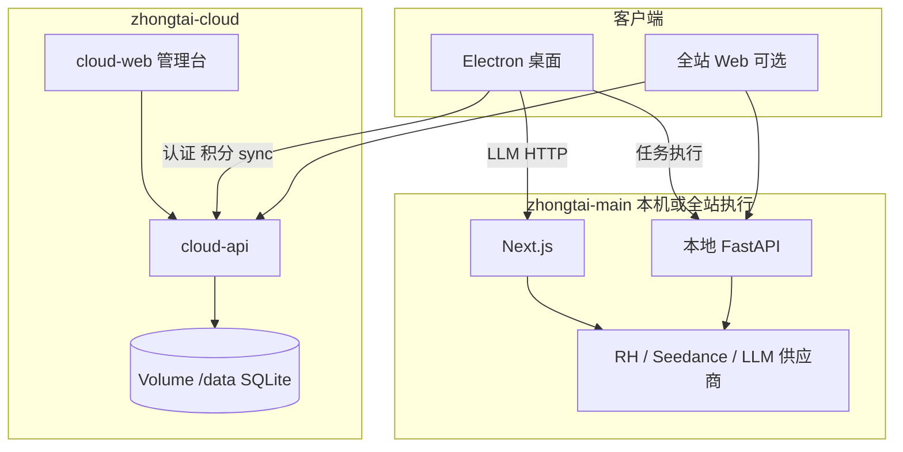

# 云端控制面顶层架构

> 状态：架构设计（2026-07-27）  
> 适用范围：桌面客户端 + 北京 Zeabur 云端（`zhongtai-cloud`）持续扩张  
> 相关：[`ZEABUR-CLOUD-SERVICE-HANDOFF.md`](./ZEABUR-CLOUD-SERVICE-HANDOFF.md)（发布边界）· `zhongtai-cloud/contracts/CONFIG_KEYS.md`（同步白名单）

本文回答三件事：

1. **谁真正负责云端**（仓库与运行时职责）  
2. **控制面如何随功能扩张**（板块、非代码运营、用户数据）  
3. **配置如何分类**（能否下发桌面、能否进管理后台）

---

## 1. 结论摘要

| 问题 | 结论 |
|------|------|
| 云端真源仓库 | **`F:\A-xiangmu\21-zhongtai\zhongtai-cloud`** |
| 产品 / 执行仓库 | **`F:\A-xiangmu\21-zhongtai\zhongtai-main`**（UI + 本地视频/图片管线；认证/积分/密钥代理到云端） |
| 线上形态 | 北京 slim：`zhongtai-cloud-api` + `zhongtai-cloud-web`；API Volume `/data/accounts.db` |
| 短期架构 | **模块化单体控制面**，不要过早拆微服务 |
| 运营目标 | 换模型、改价格、启停功能尽量走**后台配置**，少改代码发版 |
| 密钥长期方向 | 控制面保管长期 Key；桌面 sync 过渡期保留；浏览器永不持有长期供应商 Key |

无效目录：`zhongtai-main-beijing-dockers`（空，不当真源）。

---

## 2. 双仓库职责

```text
┌─────────────────────────────────────────────────────────────┐
│  zhongtai-cloud = 控制面（Control Plane）                      │
│  · 账号 / 会话 / 积分 / 兑换码 / 计费校验                        │
│  · 模型与供应商配置（加密）+ /api/config/sync                   │
│  · 管理后台 · 桌面更新清单（manifest）                          │
│  · 源码：api/app/main.py → auth / credit / config / central    │
└─────────────────────────────────────────────────────────────┘
                              ▲
                              │ CLOUD_API_URL
                              │ Cookie 会话 / 扣费 / sync
┌─────────────────────────────────────────────────────────────┐
│  zhongtai-main = 执行面（Execution Plane）                     │
│  · Electron + Next UI · 本地 FastAPI（视频/图片/ffmpeg）        │
│  · RunningHub / Seedance 任务 · GEO / 智能体执行                │
│  · Next app/api/auth|credit → 代理云端                          │
│  · Electron config-sync → credential-store → 子进程 env        │
└─────────────────────────────────────────────────────────────┘
```

### 2.1 云端（真源）关键路径

| 路径 | 角色 |
|------|------|
| `api/app/main.py` | FastAPI 入口（明确不含视频管线） |
| `api/app/routes/auth.py` | 注册 / 登录 / Magic Link / me |
| `api/app/routes/credit.py` | 余额、consume、metered、兑换码、管理员调账 |
| `api/app/routes/config.py` | `POST /sync`；模型 providers CRUD |
| `api/app/routes/central.py` | 桌面强制更新 manifest |
| `api/app/lib/api_auth.py` | `SCENE_COST_TABLE` + 幂等扣费 |
| `api/app/lib/credit_pricing.py` | `billing_key` → 金额 |
| `api/app/lib/provider_config.py` | 加密供应商表 + sync 载荷 |
| `web/components/admin-*-view.tsx` | 管理后台（兑换码 / 用户 / 模型配置） |

### 2.2 主程序（代理与执行）关键路径

| 路径 | 角色 |
|------|------|
| `lib/fastapi-base.ts` | `CLOUD_API_URL` vs 本地 FastAPI 分流 |
| `lib/cloud_client.py` | Python 混合：会话 / 扣费委托云端 |
| `lib/api/with-auth.ts` | Next 侧扣费 / metered |
| `lib/credit-pricing/registry.ts` | 与云端对齐的价格镜像（展示与本地校验） |
| `electron/services/config-sync-client.ts` | 拉配置 |
| `electron/services/env-injector.ts` | 注入子进程 |
| `main.py` | **本地**业务 FastAPI（非控制面） |

混合规则：设置了 `CLOUD_API_URL` 时，认证与积分以云端为准；未设置时开发机可走本地 SQLite。

---

## 3. 运行时拓扑（目标稳态）



| 服务 | 仓库 | 持久化 | 说明 |
|------|------|--------|------|
| `zhongtai-cloud-api` | cloud | **必须** Volume `/data` | 账户与配置权威库 |
| `zhongtai-cloud-web` | cloud | 无业务 Volume | 管理台 + 代理 |
| 桌面本地 Next/API | main | userData / video-cache | 重计算与媒体 |
| 全站 web/api（若部署） | main | 可选独立 Volume | 执行面；账号仍应指云端 |

发布红线见 HANDOFF §7：禁止删服重建、动 Volume、覆盖 `accounts.db`、整表覆盖环境变量。

---

## 4. 功能板块（控制面产品化）

随业务扩张，控制面按**稳定功能码**组织，而不是按页面散落常量。

### 4.1 功能目录（Feature Catalog）

示例功能码（可演进，一旦上线应保持稳定）：

| 功能码 | 业务含义 | 当前近似 scene / billing |
|--------|----------|---------------------------|
| `image.poster.generate` | 海报图创作 | `poster_image` |
| `image.general.generate` | 图片工作台·图片创作 | `image_creation` |
| `video.dh.economy.segment` | 经济型数字人段 | `video.dh_economy_segment` |
| `video.dh.premium.segment` | 高价数字人段 | `video.dh_v2_segment` |
| `video.promo.segment` | 宣传视频段 | `video.promo_segment` |
| `geo.article.generate` | GEO 文章 | `geo.article` |
| `copywriting.llm_call` | 文案 LLM | `copywriting.llm_call` |
| `agent.chat` | 智能体对话 | `ai_chat` / metered |

每个功能码绑定：**路由策略、计费项、权限、统计维度**。

### 4.2 供应商中心（Provider Hub）

| 能力类 | adapter / 形态 | 后台可配字段 |
|--------|----------------|--------------|
| LLM OpenAI 兼容 | `openai_chat` | URL、Key、Model、优先级、启停 |
| 豆包方舟 | `ark_chat` | 同上 |
| Seedance / 星河 | `seedance_video` / `xinghe_video` | URL、Key、Model、`media_mode` |
| RunningHub 工作流 | **独立类型**（勿混进纯 LLM 池） | Key + 工作流 ID / App ID + 归属功能 |
| ASR / 搜索 | 独立类型或扁平原 sync key | 按是否允许下发桌面区分 |

已有表：`model_provider_configs` + `config_meta`。下一阶段扩展：

- 按**功能码**绑定主备供应商（非仅全局排序池）  
- 健康检查、超时、重试、灰度版本  
- RunningHub 工作流与 LLM 供应商分栏管理  

### 4.3 路由策略（非代码调整：换模型）

运营在管理台选择：

1. 功能码 → 主供应商 → 备供应商列表（有序）  
2. 失败条件（如 HTTP 429/5xx）是否切换  
3. 可选灰度百分比 / 回滚到上一路由版本  

客户端只提交「我要执行功能码 X」；解析路由在云端或由 sync 下发的**路由快照**完成。  
过渡期可保留现有业务默认链：**GPT → Claude → DeepSeek → 豆包**，但最终应以功能绑定为准。

### 4.4 计费中心（非代码调整：改价格）

| 模式 | 示例 | 规则 |
|------|------|------|
| 固定价 | `poster_image` / `image_creation` = 20 | 云端表权威；客户端金额不可信 |
| 按段 | 经济型 250/段、高价 450/段 | `billing_key` + `segment_count` |
| 档位价 | 文案/GEO 经济 vs 高级 | 白名单金额集合 |
| 版本化 | `price_version` | 生效时间、回滚、流水必记版本 |

流水字段目标：`billing_item`、`price_version`、`route_version`、实际模型、`ref_id`（幂等）。

**已知漂移（发布阻断）**：主程序已有 `image_creation=20`，云端 `SCENE_COST_TABLE` 仍缺该项——上线前必须对齐（见 HANDOFF §4.2）。

### 4.5 用户数据中心

| 层级 | 内容 | 存放 |
|------|------|------|
| L0 已有 | 用户、会话、积分、兑换码、模型配置 | 云端 Volume SQLite |
| L1 近期 | 任务元数据、项目索引、生成历史索引 | 云端表 + 对象引用 |
| L2 媒体 | 图片/视频/附件二进制 | OSS（库只存 URL） |
| L3 高敏 | 浏览器 Cookie、平台登录态 | 默认本机；若上云须独立加密保险库 |

原则：云端权威管「谁、多少钱、用什么配置」；重文件与本机隐私默认不进控制面库。

### 4.6 桌面配置同步

- 协议：`POST /api/config/sync`（需登录）  
- 载荷：完整 `keys` + `providers`（+ `MODEL_PROVIDERS_JSON_B64`）  
- 频率：约 1 分钟版本检查；变更后重启子进程  
- **硬约束**：必须返回**完整快照并合并**，禁止「只含新增项」覆盖客户端已有配置  

打包进安装包的仅连接类：`CLOUD_API_URL`、`UPDATE_FEED_URL` 等；模型 Key **不**烤进安装包。

---

## 5. 配置分类总表（运营 / 部署视角）

完整键名清单以 `zhongtai-cloud/contracts/CONFIG_KEYS.md` 与 HANDOFF §10.6 为准。架构层只定**分类规则**：

| 类别 | 示例 | 部署位置 | 下发桌面 | 进管理后台 |
|------|------|----------|----------|------------|
| A. 控制面密钥 | `CREDIT_ADMIN_*`、`CONFIG_ENCRYPTION_KEY`、`EMAIL_HASH_SALT`、`CREDIT_METERED_KEY` | 仅 cloud-api/web | **否** | 否（或仅改密码哈希流程） |
| B. 模型供应商 | `NEWAPI_*`、`ARK_*`、`SEEDANCE_*`、结构化 providers | cloud DB / 池 | **是**（经 sync） | **是**（模型配置） |
| C. 业务工作流 | `RUNNINGHUB_API_KEY`、RH App/Workflow ID | Key 可 sync；Workflow ID 按功能配置 | Key：是；Workflow：宜后台按功能 | Key 扁平原或 RH 专区；ID 勿丢进 LLM 池 |
| D. 运行时 / 部署 | `PORT`、`DATA_DIR`、`FFMPEG_*`、超时并发 | 各执行环境 | 部分超时可 sync | **否**（运维面板，非运营选模型） |
| E. 连接与更新 | `CLOUD_API_URL`、`UPDATE_FEED_URL`、`CENTRAL_*` 版本策略 | 客户端烤入 / cloud manifest | 连接 partial；策略在服务端 | 版本说明可后台改 |

### 5.1 易混淆对照

| 勿合并 | 原因 |
|--------|------|
| `CONFIG_KEY_POOL_*` vs `CENTRAL_KEY_POOL_*` | 现 sync 池 vs 旧激活池 |
| `CLOUD_API_URL` vs `FASTAPI_URL` | 控制面 vs 本地/全站执行 API |
| `NEWAPI_*` vs `SONETTO_*` | 后者废弃；sync 不投递 SONETTO |
| RunningHub vs Seedance vs LLM | 不同协议；后台须分栏 |

### 5.2 永不进入浏览器 `NEXT_PUBLIC_*`

任何供应商 API Key、管理员密钥、计量密钥、加密主密钥、OSS/邮件/短信密钥。

---

## 6. 演进阶段

| 阶段 | 目标 | 完成标志 |
|------|------|----------|
| **P0** | 计费合同对齐 + 安全发布 | 云端含 `image_creation`；Volume 对账通过；HANDOFF 验收清单打勾 |
| **P1** | 功能目录 + 按功能绑模型/价格 | ✅ 已完成（2026-07-28）：`feature_catalog` + 后台「功能与计费」+ sync `FEATURE_CATALOG_JSON_B64` + dh-v2 plan-script 试点；北京 api/web 已发 |
| **P2** | 用户业务元数据 + OSS | 任务/历史可跨设备查询；大文件出库 |
| **P3** | 模型网关 / 短时令牌 | 桌面少持或不持长期供应商 Key |
| **P4** | 基础设施升级 | SQLite → PG；Redis；KMS；Worker（增量迁移，禁止换盘） |

P0 执行流程仍以 [`ZEABUR-CLOUD-SERVICE-HANDOFF.md`](./ZEABUR-CLOUD-SERVICE-HANDOFF.md) 为准。

---

## 7. 管理后台信息架构（目标）

```text
管理后台
├── 用户与积分（已有）
├── 兑换码（已有）
├── 模型与供应商
│   ├── 大语言模型
│   ├── 视频模型（Seedance / 星河）
│   └── 工作流（RunningHub）     ← 待建分栏
├── 功能与路由                   ← 待建：功能码 → 供应商绑定
├── 计费目录                     ← 待建：价格版本
├── 桌面更新                     ← manifest / 版本说明
└── 审计（扣费 / 改价 / 改路由）  ← 待建
```

---

## 8. 设计原则（决策锁定）

1. **控制面与执行面分离**：云端不算视频；执行面不自定最终价格。  
2. **金额云端权威**：客户端只传 `scene` / `billing_key` + 参数。  
3. **配置可运营**：换模型、改价格优先后台，发版只为协议演进。  
4. **Volume 零丢失**：换版只改 tag / 单项环境变量 / Restart。  
5. **Sync 完整快照**：合并而非覆盖丢失。  
6. **密钥分级**：控制面密钥 ≠ 可 sync 供应商 Key ≠ 浏览器可见配置。  
7. **功能码稳定**：页面可以改，功能码与流水字段保持兼容。  

---

## 9. 文档与契约索引

| 文档 | 用途 |
|------|------|
| 本文 | 顶层架构与板块边界 |
| [`ZEABUR-CLOUD-SERVICE-HANDOFF.md`](./ZEABUR-CLOUD-SERVICE-HANDOFF.md) | 发布红线、验收、P0 任务 |
| `zhongtai-cloud/docs/deploy/ZEABUR.md` | 北京部署 SOP |
| `zhongtai-cloud/contracts/CONFIG_KEYS.md` | sync 白名单与渠道三要素 |
| `zhongtai-cloud/api/app/lib/api_auth.py` | 云端 scene 价表真源 |
| `zhongtai-main/lib/credit-pricing/registry.ts` | 主程序价格镜像 |

---

## 10. 修订记录

| 日期 | 说明 |
|------|------|
| 2026-07-27 | 初版：双仓库职责、板块、配置分类、演进阶段 |
| 2026-07-29 | P1 标记完成：功能目录/DB 定价/路由绑定/后台/sync/北京安全发布 |
